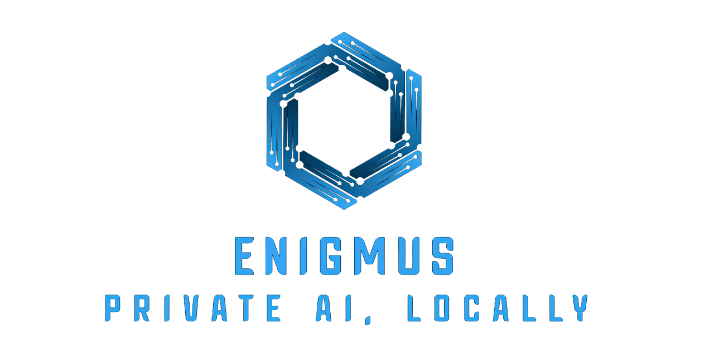

<h1 align=center>Enigmus - Private AI, Locally</h1>
<h2 align="center">
<a target="_blank" href="https://enigmus.cc" rel="nofollow">Visit Site</a>
</h2>

<p align=center>
  <a href="https://github.com/vercel/next.js/releases/tag/v16.1.1">
    
  </a>
  
</p>



Homepage and blog for Enigmus AI - a privacy-focused AI platform that runs locally on user devices.

## Key Features

- Static site generation with Next.js
- MDX support for rich content
- Dark mode support
- Blog with categories and related posts
- Search functionality
- Responsive design with Tailwind CSS

## Development

**Prerequisites:** Node.js LTS

```bash
# Install dependencies
npm install

# Run development server
npm run dev

# Lint code
npm run lint
```

## Build & Deploy

```bash
# Production build
npm run build

# Static export (outputs to /out for GitHub Pages)
npm run export
```

## Project Structure

```
/content/        # Markdown content (pages and blog posts)
/config/         # Site configuration (menu, theme, social)
/pages/          # Next.js routes
/layouts/        # Page layouts and components
/lib/            # Content parsing utilities
/public/         # Static assets
```

## Color Guide

### Brand Blues (from logo)

| Color | Hex | RGB |
|-------|-----|-----|
| Primary Blue | `#1FA3FB` | rgb(31, 163, 251) |
| Dark Blue | `#0872E3` | rgb(8, 114, 227) |

### Text Colors (Apple-style)

| Color | Hex | RGB |
|-------|-----|-----|
| Black (Primary) | `#1D1D1F` | rgb(29, 29, 31) |
| Dark Gray | `#424245` | rgb(66, 66, 69) |
| Gray | `#86868B` | rgb(134, 134, 139) |
| Light Gray | `#D2D2D7` | rgb(210, 210, 215) |

### Backgrounds

| Color | Hex | RGB |
|-------|-----|-----|
| White | `#FFFFFF` | rgb(255, 255, 255) |
| Off-White | `#FBFBFD` | rgb(251, 251, 253) |
| Light Surface | `#F5F5F7` | rgb(245, 245, 247) |

### Dark Mode

| Color | Hex | RGB |
|-------|-----|-----|
| Black BG | `#000000` | rgb(0, 0, 0) |
| Dark Surface | `#1C1C1E` | rgb(28, 28, 30) |
| Dark Gray BG | `#2C2C2E` | rgb(44, 44, 46) |
| Light Text | `#F5F5F7` | rgb(245, 245, 247) |

## License

Copyright (c) 2024 - Present, Developed by [Enigmus.cc](https://enigmus.cc)

Released under the [MIT](LICENSE) license.
