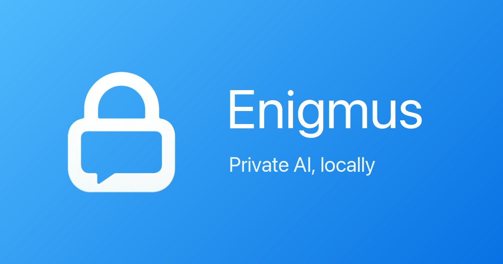

<h1 align=center>Enigmus - Private AI, Locally</h1>
<h2 align="center">
<a target="_blank" href="https://enigmus.cc" rel="nofollow">Visit Site</a>
</h2>

<p align=center>
  <a href="https://github.com/vercel/next.js/releases/tag/v16.1.1">
    
  </a>
  
</p>



Homepage and blog for Enigmus AI - a privacy-focused AI platform that runs locally on user devices.

The Enigmus app is **live on the App Store for iPhone, iPad, and Mac** ([App Store listing](https://apps.apple.com/us/app/enigmus/id6771532268), [Mac App Store](https://apps.apple.com/us/app/enigmus/id6771532268?platform=mac)). App Store marketing copy lives in [docs/app-store-listing.md](docs/app-store-listing.md).

## Key Features

- Static site generation with Next.js
- MDX support for rich content
- Dark mode support
- Blog with categories and related posts
- Search functionality
- Responsive design with Tailwind CSS

## Development

**Prerequisites:** Node.js LTS

```bash
# Install dependencies
npm install

# Run development server
npm run dev

# Lint code
npm run lint
```

## Build & Deploy

```bash
# Production build
npm run build

# Static export to /out (consumed by Netlify build + the deploy.sh GitHub Pages fallback)
npm run export
```

**Production hosting:** Netlify, fronted by Cloudflare (custom domain `enigmus.cc`). Netlify auto-builds on push to `main`. The `deploy.sh` script also publishes to a `gh-pages` branch as a backup path.

## Project Structure

```
/content/        # Markdown content (pages and blog posts)
/config/         # Site configuration (menu, theme, social)
/pages/          # Next.js routes
/layouts/        # Page layouts and shortcode components
/lib/            # Content parsing utilities
/public/         # Static assets (favicon, logos, press kit, OG images)
/public/press/   # Press kit assets, served at /press/*
/docs/           # Internal reference docs (App Store listing copy, not published)
```

See [CLAUDE.md](CLAUDE.md) for content pipeline internals (`[regular].js` routing, layouts, frontmatter, taxonomy parsing).

## Published Pages

| URL | Source | Purpose |
|---|---|---|
| `/` | `pages/index.js` | Landing page |
| `/download` | `content/download.md` | Download / availability |
| `/ai-and-privacy` | `content/ai-and-privacy.md` | Privacy positioning |
| `/technology` | `content/technology.md` | Technical overview |
| `/contact` | `content/contact.md` | Contact form (`layout: contact`) |
| `/privacy-policy` | `content/privacy-policy.md` | Privacy policy — covers both app and site |
| `/terms-of-usage` | `content/terms-of-usage.md` | Terms of Use — AS-IS disclaimer, AI output caveats, Wyoming jurisdiction, binding arbitration with 30-day opt-out |
| `/press-kit` | `content/press-kit.md` | Brand assets and press resources |
| `/posts/<slug>` | `content/posts/*.md` | Blog posts |
| `/categories/<cat>` | derived | Category listings |

To add a new regular page: drop a markdown file in `content/` with title/description/layout frontmatter — it routes automatically via `pages/[regular].js`.

## Press Kit

Public-facing brand assets live in `public/press/` and are listed (with previews and download links) on [/press-kit](https://enigmus.cc/press-kit).

**Naming convention:** prefix every file with its source dimension in pixels, e.g. `1024-app-icon.png`, `586-lock-mark.svg`. This keeps the file's size obvious in the URL and in `content/press-kit.md` listings.

**Adding new assets:**
1. Drop file in `public/press/` with `{size}-{name}.{ext}`
2. Add a row in `content/press-kit.md` with a preview and download link
3. Commit + push → Netlify rebuilds → asset available at `https://enigmus.cc/press/<filename>`

Do not commit Photoshop / Illustrator / Sketch source files (`.psd`, `.ai`, `.sketch`) to `public/press/` — those are private working files and should stay in the `enigmus-assets/` working folder.

## Launch Post Screenshots

App screenshots used in the [Enigmus 1.0 launch post](content/posts/enigmus-1-0-launch.md). Originals are the framed iPhone mockups in `../enigmus-assets/Enigmus-screenshots-iphone/` (1242×2688 PNG); the published versions were converted to webp and resized to 720px wide with `cwebp -q 82 -resize 720 0 <src>.png -o public/images/<name>.webp`.

| Image | Source | Feature shown |
|---|---|---|
| [launch-privacy.webp](public/images/launch-privacy.webp) | `ios_1_2.png` | Onboarding — private / local-only / open-weights principles |
| [launch-chat.webp](public/images/launch-chat.webp) | `ios_1_3.png` | Multi-turn chat, streaming, works offline |
| [launch-models.webp](public/images/launch-models.webp) | `ios_1_4.png` | RAM-aware model installer (Qwen3 from Hugging Face) |
| [launch-benchmark.webp](public/images/launch-benchmark.webp) | `ios_1_5.png` | Per-model benchmark — load time, memory, tokens/sec |
| [launch-math.webp](public/images/launch-math.webp) | `ios_1_6.png` | Markdown, code, and LaTeX math rendering |
| [launch-dark-mode.webp](public/images/launch-dark-mode.webp) | `ios_1_7.png` | Dark mode / adaptive layout |

The post hero is [launch-hero.webp](public/images/launch-hero.webp) — the white lock mark ([586-lock-mark-white.png](public/press/586-lock-mark-white.png)) centered on a brand-blue (`#4FB9FC`→`#0872E3`) gradient, generated at 1280×640 with:

```bash
magick -size 1280x640 -define gradient:angle=135 gradient:'#4FB9FC'-'#0872E3' bg.png
magick public/press/586-lock-mark-white.png -resize 384x384 lock.png
magick bg.png lock.png -gravity center -composite hero.png
cwebp -q 88 hero.png -o public/images/launch-hero.webp
```

The `[single].js` layout forces a 2:1 header, so the hero is landscape and the portrait screenshots are only used inline in the post body.

## Color Guide

### Brand Blues (from logo)

| Color | Hex | RGB |
|-------|-----|-----|
| Primary Blue | `#1FA3FB` | rgb(31, 163, 251) |
| Dark Blue | `#0872E3` | rgb(8, 114, 227) |

### Text Colors (Apple-style)

| Color | Hex | RGB |
|-------|-----|-----|
| Black (Primary) | `#1D1D1F` | rgb(29, 29, 31) |
| Dark Gray | `#424245` | rgb(66, 66, 69) |
| Gray | `#86868B` | rgb(134, 134, 139) |
| Light Gray | `#D2D2D7` | rgb(210, 210, 215) |

### Backgrounds

| Color | Hex | RGB |
|-------|-----|-----|
| White | `#FFFFFF` | rgb(255, 255, 255) |
| Off-White | `#FBFBFD` | rgb(251, 251, 253) |
| Light Surface | `#F5F5F7` | rgb(245, 245, 247) |

### Dark Mode

| Color | Hex | RGB |
|-------|-----|-----|
| Black BG | `#000000` | rgb(0, 0, 0) |
| Dark Surface | `#1C1C1E` | rgb(28, 28, 30) |
| Dark Gray BG | `#2C2C2E` | rgb(44, 44, 46) |
| Light Text | `#F5F5F7` | rgb(245, 245, 247) |

## License

Copyright (c) 2024 - Present, Developed by [Enigmus.cc](https://enigmus.cc)

Released under the [MIT](LICENSE) license.
